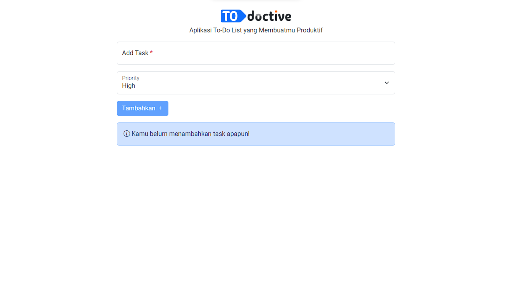

# To Do Ctive

Aplikasi to-do list yang membuatmu produktif

## Installation

1. Clone repository
   ```
   git clone https://github.com/faridrawing/todoctive.git
   ```
2. Buka direktori repository
   ```
   cd todoctive
   ```
3. Instal package(s) yang dibutuhkan
   ```
   npm install
   ```
4. Jalankan aplikasi dalam mode development
   ```
   npm run dev
   ```
5. Build aplikasi (opsional)
   ```
   npm run build
   ```

## Build With

- React.js ⚛️
- Bootstrap 🅱

## Documentation




